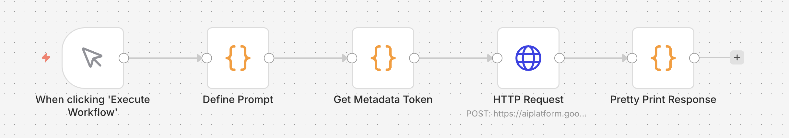

# n8n on Google Cloud Run

[](https://github.com/nhsy/gcp-n8n-workflows/actions/workflows/validate.yml)

This project provides a robust, production-ready deployment of [n8n](https://n8n.io/) on Google Cloud Run using Terraform. It includes automated infrastructure provisioning, secure secret management, and a demonstration workflow that leverages GCP Workload Identity to interact with Vertex AI.

## Architecture Highlights

- **Cloud Run**: Serverless container execution for n8n.
- **Cloud SQL (PostgreSQL)**: Managed database for persistent storage.
- **Secret Manager**: Secure handling of database credentials and n8n encryption keys.
- **IAM Identity**: Dedicated Service Account with minimal privileges for Cloud SQL and Vertex AI access.
- **Vertex AI Integration**: A demo workflow that authenticates via the GCP Metadata Server using a custom JavaScript Code node.

> [!NOTE]
> The custom JavaScript node is a temporary workaround until native [Application Default Credentials (ADC)](https://github.com/n8n-io/n8n/pull/23507) support is merged into the official n8n Vertex AI node.

## Prerequisites

- [Google Cloud Account](https://cloud.google.com/) and a Project ID.
- [Google Cloud SDK (gcloud CLI)](https://cloud.google.com/sdk/docs/install)
- [Terraform](https://www.terraform.io/) (>= 1.5.0)
- [Go Task](https://taskfile.dev/)
- [pre-commit](https://pre-commit.com/)

## Getting Started

### 1. Authenticate with Google Cloud

Ensure you are authenticated and have the correct project selected:

```bash
# Log in to the Google Cloud CLI
gcloud auth login

# Set your active GCP project
gcloud config set project your-gcp-project-id

# Generate Application Default Credentials (ADC) for Terraform
gcloud auth application-default login
```

### 2. Configure Variables

Create your `terraform.tfvars` from the example:

```bash
cp terraform.tfvars.example terraform.tfvars
```

Then edit `terraform.tfvars` and update your Project ID:

```hcl
project_id         = "your-gcp-project-id"
```

### 3. Initialize and Deploy

Use the provided `Taskfile.yml` to manage the lifecycle of the infrastructure:

```bash
# Initialize Terraform and install providers
task init

# View the execution plan
task plan

# Provision the infrastructure
task up
```

## Standard Task Interface

| Command      | Action                                                      |
| ------------ | ----------------------------------------------------------- |
| `task init`  | Initializes Terraform backend and providers.                |
| `task plan`  | Generates and shows an execution plan.                      |
| `task up`    | Applies the Terraform configuration to provision resources. |
| `task down`  | Destroys all provisioned infrastructure.                    |
| `task lint`  | Formats code and runs `tflint` across all modules.          |
| `task clean` | Removes local terraform state and temporary files.          |

## Project Structure

- `docs/solution-design.md`: Detailed architecture and implementation design.
- `templates/`: Contains the n8n workflow template (`.tpl`) which is rendered via Terraform.
- `workflows/`: Output directory for the rendered workflow JSON.
- `*.tf`: Terraform configuration files (Provider, IAM, Database, Cloud Run, etc.).
- `.github/workflows/ci.yml`: GitHub Actions pipeline for linting and validation.

## Demo Workflow



Once deployed, you can access the n8n UI at the URL provided in the Terraform outputs. Locate the rendered `workflows/demo-vertex-ai-workflow.json` and import it into n8n.

The workflow demonstrates:

1. **Authentication**: Fetching an OAuth token from `metadata.google.internal`.
2. **Vertex AI Call**: Using the token to prompt the configured Vertex AI model (`vertexai_model_id`).

## Security

This project follows security best practices:

- **No Hardcoded Secrets**: Uses Secret Manager and random password generation.
- **Least Privilege**: The Service Account is restricted to necessary GCP APIs.
- **Linting**: Pre-commit hooks include `gitleaks` to prevent secret accidental commits.
